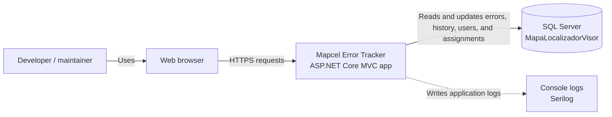
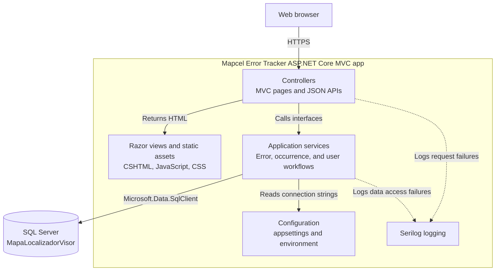
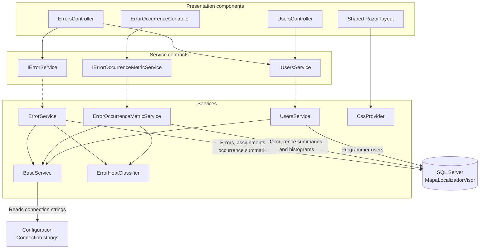

## Prerequisites

| Tool | Min version | Recommended |
|------|:-----------:|:-----------:|
| Node |    24.16    |   Latest    |
| .NET |    10.0     |    10.0     | 

## Architecture overview

These diagrams are intentionally high-level. They show the current ASP.NET Core MVC structure and the main dependency direction without documenting every route, view, query, or model.

### C1 - System context



### C2 - Container view



### C3 - Component overview



## Run the app

### Install tailwindcss using the CLI

Styling tool CSS wrapper: 

```bash
cd MapcelErrorTracker
npm install
npm run build:css
```

https://tailwindcss.com/

### Run a local version of the database

Run a local snapshot of the `MapaLocalizadorVisor` schema in Microsoft SQL Server.

### Run the application

Run the application on https. 
